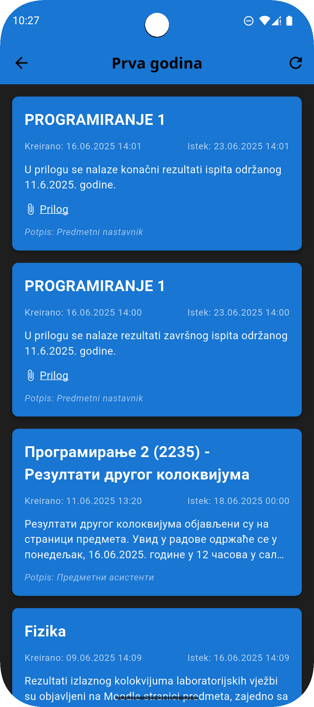
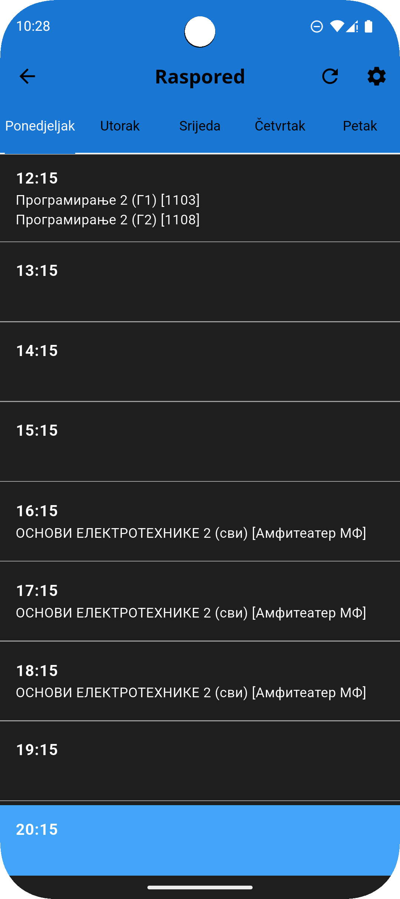
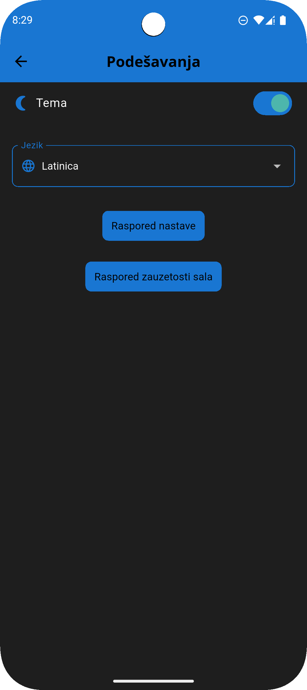
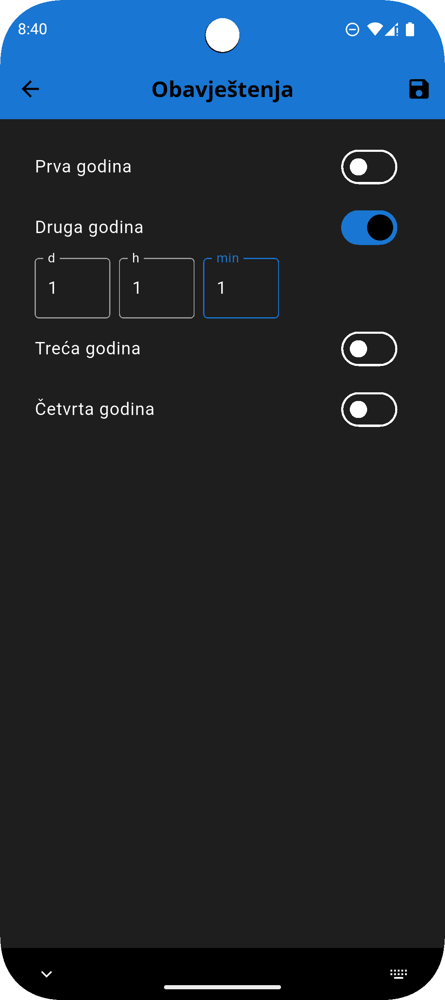
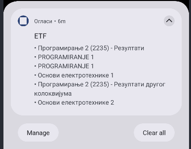

<h1 align="center">📱 ETF Oglasi</h1>

  <b>A mobile application for viewing university announcements and schedules, with offline access, localization, and smart notifications.</b> 
  Built using <a href="https://flutter.dev/">Flutter</a> and <a href="https://riverpod.dev/">Riverpod</a> for state management.

  
  
  
  

<h2>🚀 Features</h2>
<ul>
  <li>📢 Browse categorized announcements with download support</li>
  <li>📅 View weekly or daily class schedules with current hour focus</li>
  <li>🔔 Schedule personalized notifications using user-defined timers</li>
  <li>📦 Offline caching of announcements and schedules via SQLite</li>
  <li>🌐 Remote API fetching with fallback to local storage</li>
  <li>🌙 Light & dark theme selection</li>
  <li>🌍 Multi-language support (localization)</li>
  <li>⚙️ User-defined default schedule preferences (by professor, room, program, or year)</li>
</ul>

<h2>🛠️ Tech Stack</h2>
<ul>
  <li><strong>Flutter</strong> – cross-platform UI framework</li>
  <li><strong>Riverpod</strong> – state management (including <code>StateNotifier</code>)</li>
  <li><strong>SharedPreferences</strong> – for theme, locale, and notification timers</li>
  <li><strong>SQLite (sqflite)</strong> – for offline caching of announcements and schedules</li>
  <li><strong>WorkManager</strong> – for scheduling background API checks and notifications</li>
</ul>

<h2>🧠 Architecture Overview</h2>
<ul>
  <li>📂 Modular structure using <code>/features</code> for announcements, schedules, and settings</li>
  <li>🧠 Riverpod providers and <code>StateNotifier</code> for state control</li>
  <li>🗃️ Repositories abstract API and database logic</li>
  <li>🛠️ Automatic fallback to local data when offline</li>
  <li>🔁 Periodic data pulling configured based on user timers</li>
</ul>

<h2>📸 Screenshots</h2>

<table>
  <tr>
    <td></td>
    <td></td>
    <td></td>
    <td></td>
  </tr>
  <tr>
    <td></td>
    <td></td>
    <td></td>
    <td></td>
  </tr>
</table>
