<div align="center">

# 📱 ETF Oglasi


</div>

---

## 📌 Project Overview

**ETF Oglasi** is an Android application for viewing the announcements and class schedules of the Faculty of Electrical Engineering in Banja Luka, with full offline support. It notifies about new announcements, reminds you before classes, shows your schedule in home screen widgets, and comes in Serbian (Latin and Cyrillic) and English. Built as a graduation thesis project.

---

## 📥 Install

1. Open the [latest release](https://github.com/pero-grubac/ETFOglasi/releases/latest) on your phone.
2. Download **`ETFOglasi-<version>-arm64-v8a.apk`**. It works on almost every phone from the last ~8 years. If it doesn't install, use the `armeabi-v7a` file instead.
3. Open the downloaded file. Android asks you to allow installing apps from your browser or file manager ("Install unknown apps"). Allow it once.
4. Google Play Protect may warn that the app is unknown, because it isn't on Google Play. Choose **Install anyway**.

**Updating:** the app checks for a new version once a week (can be turned off in Settings) and links to the release. Install the new APK over the old one; your settings and saved data stay.

**Notifications not arriving?** Some phones (Xiaomi, Huawei, Samsung, …) stop apps in the background to save battery. The Notifications screen has a button to turn battery optimisation off for this app; see also [dontkillmyapp.com](https://dontkillmyapp.com).

**Found a bug?** Open an [issue](https://github.com/pero-grubac/ETFOglasi/issues/new). Settings → *Dnevnik grešaka* has a copy button for the app's error log. The log stays on the phone unless you copy or share it yourself.

---

## ✨ Features

**Announcements**
- 📢 All announcement boards, with attachment download
- 🆕 "New" badges and unseen counts per board
- 🔍 Search (ignores case, diacritics and Latin/Cyrillic script)
- 🔗 Tappable web and e-mail links; expired announcements are dimmed and listed last
- 🔖 Save announcements; they stay after leaving the board
- 📤 Share or copy an announcement

**Schedules**
- 📅 Weekly class schedule with the current hour highlighted, by study program and year, teacher or room
- 🏫 Room schedules week by week
- 🗓️ Add the class schedule to your calendar (.ics with weekly events)

**Notifications and widgets**
- 🔔 Notifications about new announcements for every board, with your own interval (one battery-friendly background check); tapping one opens the board
- ⏰ Reminder before each class (5–30 min, exact time)
- 🏠 Home screen widgets: today's classes, and a small one with the current and next class

**General**
- 📦 Works offline: announcements and schedules are cached in SQLite
- 🌙 Light, dark and system theme
- 🌍 Serbian in Latin and Cyrillic script, and English
- 🔄 Optional update check against GitHub releases
- 🐞 Local error log that can be copied into a bug report (nothing is sent anywhere)

---

## 🛠️ Tech Stack

| Technology                     | Usage                                                        |
| ------------------------------ | ------------------------------------------------------------ |
| Flutter / Dart                 | The app                                                      |
| Riverpod 3                     | State management (`Notifier`, `AsyncNotifier`, `FutureProvider`) |
| SQLite (sqflite)               | Cached announcements and schedules, saved announcements      |
| WorkManager                    | Background check for new announcements                       |
| flutter_local_notifications    | Announcement notifications and scheduled class reminders     |
| home_widget + Kotlin           | Home screen widgets (native `AppWidgetProvider`s)             |
| SharedPreferences              | Settings                                                     |
| Flutter Localizations (`.arb`) | Serbian Latin / Cyrillic and English                         |

---

## 🏗️ Architecture

- Modular `lib/features` structure: announcements, schedule, settings, home; shared code in `lib/core`
- Repositories for the database, services for the ETF API; Riverpod providers connect them to the screens
- Network first, falling back to the stored data when offline (schedules: stored data first, refreshed in the background)
- One periodic WorkManager task checks every board whose interval has passed
- The saved class schedule drives the class reminders and both widgets; they're refreshed whenever it changes
- The widgets' time logic is native (`android/app/src/main/java/.../NextClass.kt`), so they stay current without the app running

---

## 🚀 Setup & Run

### Prerequisites

- Flutter SDK `>=3.38.4` (Dart 3.11)
- Android Studio with Android SDK
- Physical Android device or emulator (Android 7.0+)

### 1. Clone the repository

```bash
git clone https://github.com/pero-grubac/ETFOglasi.git
cd ETFOglasi
```

### 2. Install dependencies

```bash
flutter pub get
dart run build_runner build --delete-conflicting-outputs
```

### 3. Run the app

```bash
flutter run
```

### 4. Run checks

```bash
flutter analyze
flutter test

# Native widget logic (Kotlin, android/app/src/test)
cd android && ./gradlew :app:testDebugUnitTest && cd ..

# Integration test (test/integration): needs a running emulator or a
# connected phone. A plain `flutter test` skips it.
flutter drive --driver=test/integration/driver.dart --target=test/integration/app_test.dart -d <device id>
```

### Release signing

Release builds are signed with the key described in `android/key.properties`
(not committed). Without that file they fall back to the debug key.

```properties
storePassword=<store password>
keyPassword=<key password>
keyAlias=<alias>
storeFile=<absolute path to the .jks file>
```

> Back up the keystore and its passwords. Android installs an update only if it is signed with the same key as the installed app. Without the key, every user would have to uninstall the app (and lose its data) before installing a new version.

### Releasing

Releases are built by GitHub Actions ([release.yml](.github/workflows/release.yml)).

One-time setup: in the GitHub repo, open *Settings → Secrets and variables → Actions* and add these secrets:

| Secret              | Value                                                   |
| ------------------- | ------------------------------------------------------- |
| `KEYSTORE_BASE64`   | the `.jks` file as base64 (see below)                   |
| `KEYSTORE_PASSWORD` | `storePassword` from `key.properties`                   |
| `KEY_ALIAS`         | `keyAlias` from `key.properties`                        |
| `KEY_PASSWORD`      | `keyPassword` from `key.properties`                     |

```powershell
# Windows (PowerShell): copies the keystore as base64 to the clipboard
[Convert]::ToBase64String([IO.File]::ReadAllBytes("C:\path\to\release.jks")) | Set-Clipboard
```

For every release:

1. Raise `version` in `pubspec.yaml`, e.g. `1.1.0+2` → `1.2.0+3`. The number after `+` must always go up.
2. Commit, then tag the commit with the same version and push the tag:
   ```bash
   git tag 1.2.0
   git push origin 1.2.0
   ```
3. The workflow checks that the tag matches `pubspec.yaml`, runs the analyzer and the tests, builds the APKs, checks they're signed with the release key, and creates a **draft** release.
4. Review the draft on GitHub (edit the notes if you like) and publish it. The in-app update check only sees published releases.

The workflow builds one APK per CPU type (`arm64-v8a`, `armeabi-v7a`). Flutter gives them version codes `2000+N` and `1000+N`. So don't publish a universal APK again: its version code `N` would be lower, and Android would refuse to install it over a split APK.

---

## 📸 Screenshots

<table>
  <tr>
    <td align="center">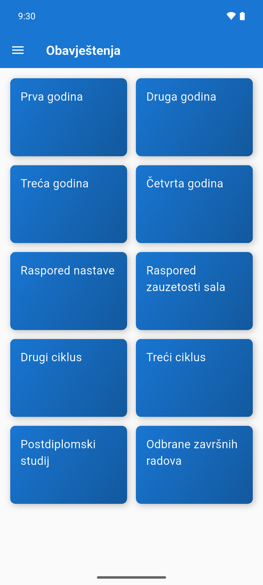<br/><sub>Home screen</sub></td>
    <td align="center">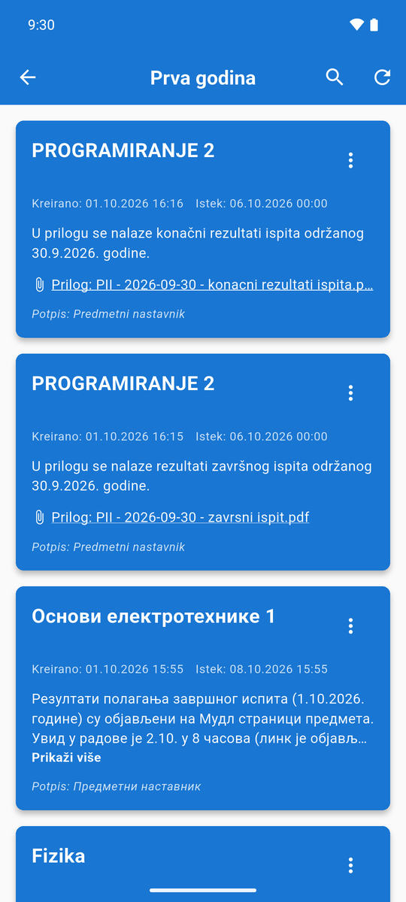<br/><sub>Announcements</sub></td>
    <td align="center">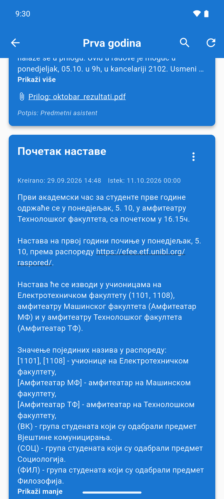<br/><sub>Announcement with a link</sub></td>
    <td align="center">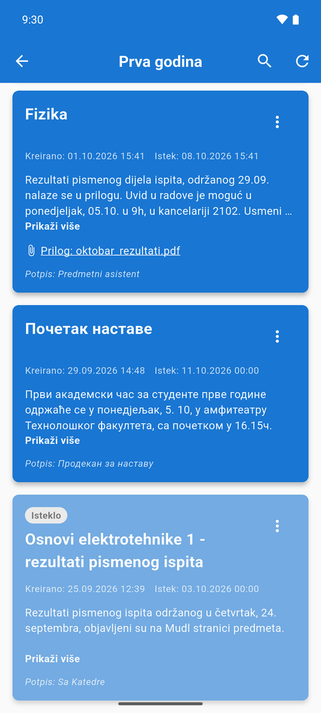<br/><sub>Expired announcement</sub></td>
  </tr>
  <tr>
    <td align="center">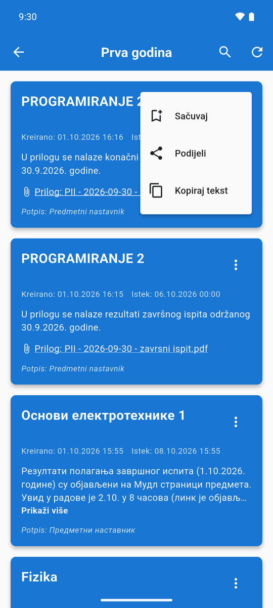<br/><sub>Save, share or copy</sub></td>
    <td align="center">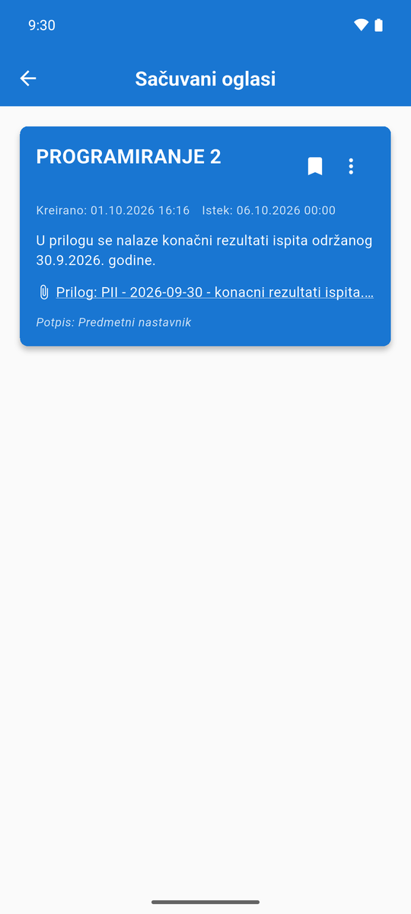<br/><sub>Saved announcements</sub></td>
    <td align="center">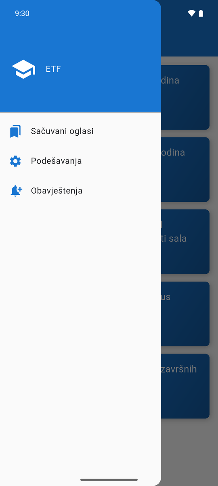<br/><sub>Menu</sub></td>
    <td align="center">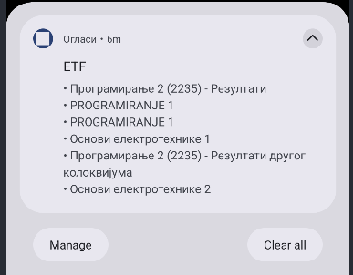<br/><sub>Notification</sub></td>
  </tr>
  <tr>
    <td align="center">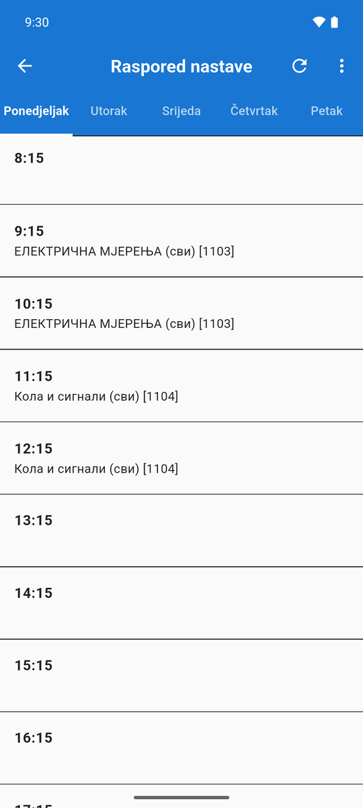<br/><sub>Class schedule</sub></td>
    <td align="center">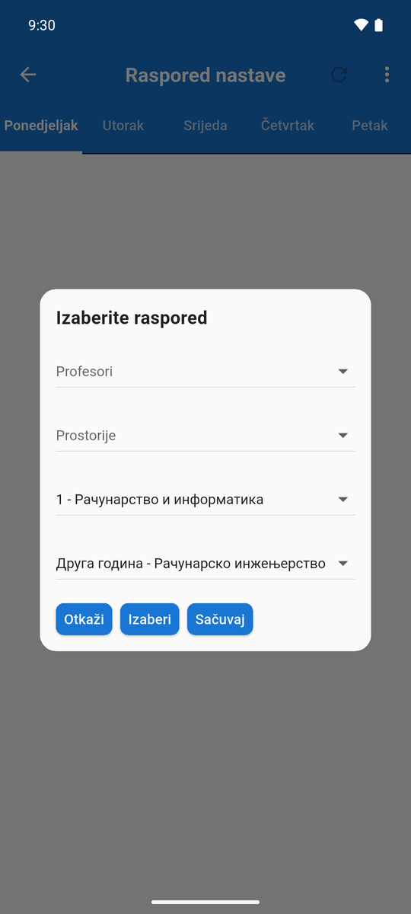<br/><sub>Choosing a schedule</sub></td>
    <td align="center">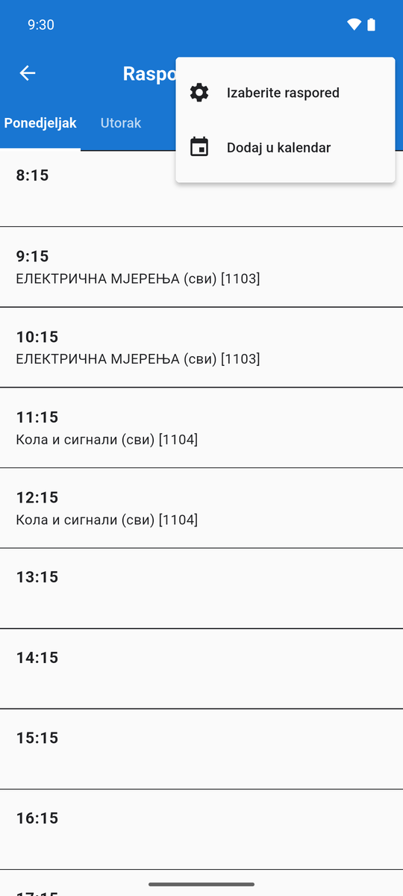<br/><sub>Schedule menu</sub></td>
    <td align="center">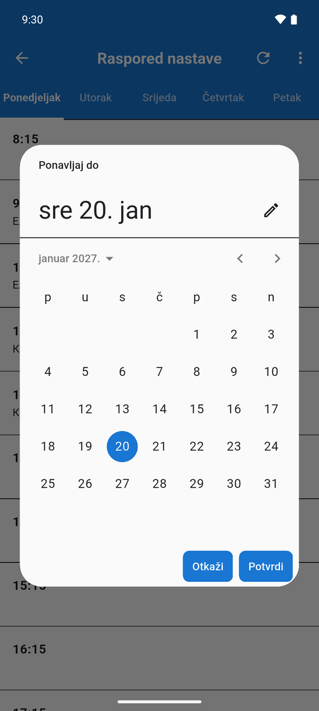<br/><sub>Add to calendar</sub></td>
  </tr>
  <tr>
    <td align="center">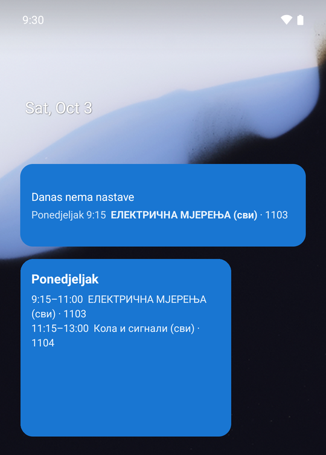<br/><sub>Home screen widgets</sub></td>
    <td align="center">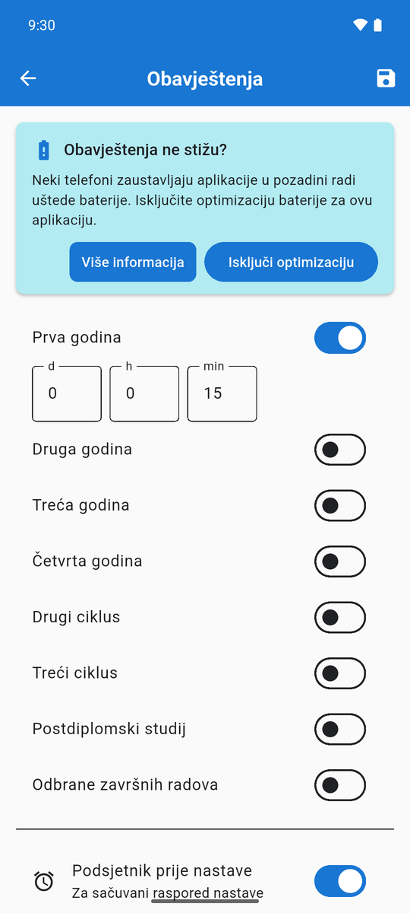<br/><sub>Notification settings</sub></td>
    <td align="center">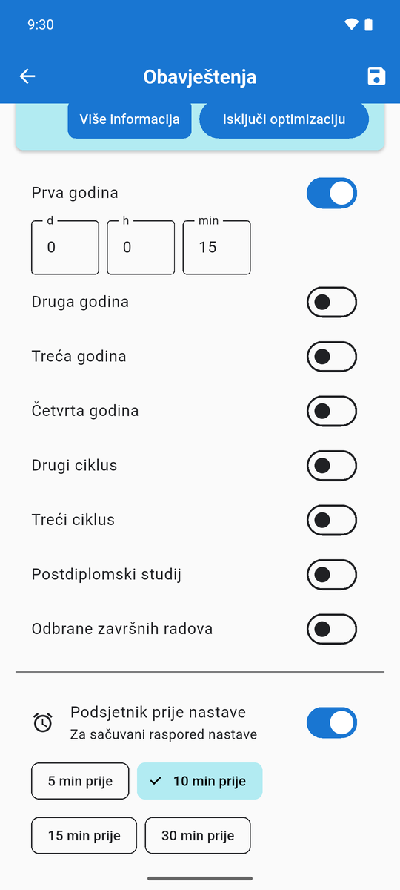<br/><sub>Class reminders</sub></td>
    <td align="center">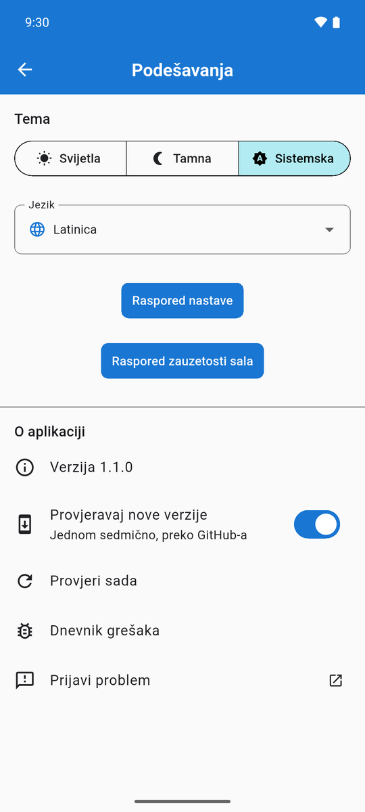<br/><sub>Settings</sub></td>
  </tr>
</table>
